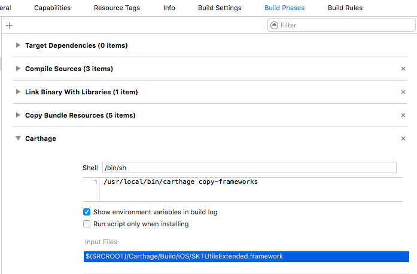

[](https://github.com/Carthage/Carthage)

# SKTUtilsExtended

2D game library [SKTUtils](https://github.com/raywenderlich/SKTUtils) extended version.

This suppoorts iOS and tvOS.

## Installation with Carthage

[Carthage](https://github.com/Carthage/Carthage) is a decentralized dependency manager that builds your dependencies and provides you with binary frameworks.

You can install Carthage with [Homebrew](http://brew.sh/) using the following command:

```bash
$ brew update
$ brew install carthage
```

To integrate SKTUtilsExtended into your Xcode project using Carthage, specify it in your `Cartfile`:

for Swift 2.1
```ogdl
github "softdevstory/SKTUtilsExtended" >= 0.1
```

for Swift 3.0
```ogdl
github "softdevstory/SKTUtilsExtended" >= 0.2
```


Run `carthage` to build the framework and drag the built `SKTUtilsExtended.framework` into your Xcode project.

### `Build Phase` run script for Carthage

Add new run script like following image.



# Licenses

* SKTUtils - [Copyright (c) 2013-2014 Razeware LLC](SKTUtils/LICENSE.txt)
